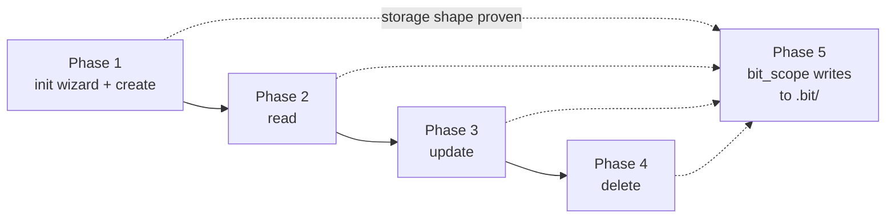

# Task Management (CRUD)

## Why

`bit init` creates an empty `.bit/` directory, but there's still nothing that can live
inside it — no way to create a task, no way to read one back, no way to fix or remove
one. Every bit of project tracking for *this very project* (the scope and plan docs
this skill produces) still lives in loose, one-off markdown files at the repo root
instead of inside `bit` itself. This scope gives `.bit/` its first real content and
resolves the storage-structure question the bootstrap scope deliberately deferred
(see `cli-bootstrap-scope.md`'s Risks & unknowns, and the README's "Open design
questions" section, which lists it as unresolved).

## Summary

Add a `bit task` command group — `create`, `read`, `update`, `delete`, and `list` — that
persists tasks as markdown-with-frontmatter files inside `.bit/tasks/`. Each task gets a
short, human-typeable ID built from a project-specific prefix (e.g. `BIT-1`); `bit init`
grows a setup wizard, usable both interactively and non-interactively (the non-interactive
path is aimed at LLM-driven use), to capture that prefix and store it in a project config
file. `delete` warns/confirms before removing anything, since it's the one destructive
command in the group. `create` takes a short title (used for both the display title and
the on-disk filename) separately from the task's longer body/details — exactly how that
longer content gets supplied is still open (see Risks).

The scope ends once all five verbs work end-to-end against real files — and, as its own
deliberate capstone, once scope documents (like this one) become a first-class task/epic
type inside `.bit/`: the same markdown this skill already produces, with frontmatter
added, rather than loose root-level `.md` files. A future command to scaffold that
frontmatter consistently (a "give me a scope template") is explicitly a follow-up, not
built in this scope. Together this sets up the next scoping pass (the backlog → todo →
doing → done state machine) to happen *inside* `bit`.

Explicitly **not** in this scope: validating or enforcing status transitions between
states — tasks get *a* status field, but the state machine governing how it changes is
the next scope after this one.

## Phases

- [x] Phase 1 — a user (or an LLM driving `bit` non-interactively) can set up a project
  and create their first task: `bit init` gains a setup wizard — usable both
  interactively and via flags — that captures a task-ID prefix and stores it in a
  `config.toml` at the project root, and `bit task create <title>` (with the full,
  possibly multi-line body supplied via a description flag — no interactive editor for
  MVP) writes a new task to `.bit/tasks/` with a unique, prefixed ID. This is the
  walking skeleton — nothing else in this scope has anything to operate on until a task
  can be durably created. The initial frontmatter is deliberately minimal — just what
  CRUD needs to function — since the right shape for a task document isn't known yet
  and markdown+frontmatter can grow additively as that becomes clearer.
  Touches: `cmd/init.go`, new `cmd/task*.go`, new `config.toml`, `README.md` (resolve
  the "Storage structure" open question once it's decided)

- [x] Phase 2 — a user can find and review the tasks they've created: `bit task list`
  shows every task at a glance, and `bit task read <id>` shows one task's full content.
  Bundled into one phase since both are non-destructive read paths over the same
  storage with little independent risk — flag if you'd rather split them.
  Touches: new `cmd/task*.go`

- [x] Phase 3 — a user can correct a task after the fact: `bit task update` edits an
  existing task's fields without recreating it.
  Touches: new `cmd/task*.go`

- [x] Phase 4 — a user can safely remove a task they no longer need: `bit task delete`
  warns/confirms before removing anything, so a typo'd ID doesn't silently destroy work.
  Touches: new `cmd/task*.go`

- [x] Phase 5 — the next scoping pass can happen inside `bit` instead of loose root
  files: scope documents become a first-class task/epic type inside `.bit/` — the same
  scope markdown this skill already writes, with frontmatter added so it's addressable
  through the CRUD commands built in Phases 1–4. A consistent template/scaffold command
  is a deliberate follow-up, not part of this phase. This is the scope's defined finish
  line, per its own success criterion.
  Concrete acceptance test: importing this project's own first two scopes proves it
  end-to-end — `cli-bootstrap-scope.md` becomes `BIT-1` and `task-crud-scope.md` becomes
  `BIT-2`, in delivery order. (Their plans stay loose root files for now — the next
  scoping pass, going deeper into this scope's task model, is what actually gets planned
  and imported next; this import just seeds `.bit/` with real sample data ahead of the
  eventual UI/TUI work.)
  Touches: `.claude/skills/bit_scope/SKILL.md`, `.bit/` (scope-type task storage)

## Visual aid

## Risks & unknowns

- **Unknown:** Exactly how task IDs get assigned (scan existing files in `.bit/tasks/`
  vs. a stored counter) — the directory itself (`.bit/tasks/`) is now decided.
  **Resolve by:** Decide directly while planning Phase 1 — `bit` controls both sides,
  no external unknown to spike.
  **De-risk before planning?** No — small enough to settle in bit_plan.

- **Unknown:** Exactly which frontmatter fields a scope-type task needs (beyond the
  fields a regular task carries) so it's addressable like any other task.
  **Resolve by:** Decide when Phase 5 is planned, once Phases 1–4 have proven out what
  a real task record looks like.
  **De-risk before planning?** No — deliberately deferred; deciding now would mean
  planning against a data model that doesn't exist yet.

## Context
See scope: [task-crud-scope.md](./task-crud-scope.md)
Recap: `.bit/` exists but nothing can live inside it yet; this plan covers Phases 1–4 —
init wizard + `task create`, `task list`/`read`, `task update`, `task delete` — giving
`.bit/tasks/` real, working CRUD.

**Phase 5 is deliberately not planned here.** The scope's own Risks & unknowns section
says its frontmatter shape "should be decided when Phase 5 is planned, once Phases 1–4
have proven out what a real task record looks like" — planning it now would mean
designing against a data model this plan hasn't built yet. Once Phases 1–4 are
implemented, run bit_plan again for Phase 5 alone.

## How this plan works
The entry point is the Cobra root command, exercised in-process (`NewRootCmd()` +
`SetArgs`/`SetOut`/`SetIn` + `Execute()`), matching the pattern already established in
`cmd/root_test.go` and `cmd/init_test.go`. Phase 1 is the walking skeleton: Step 1 makes
`bit init --prefix BIT` write `config.toml`; Step 2 is forced by a second test that omits
`--prefix` and can't pass without real interactive prompting; Step 3 closes the empty-input
edge. Step 4 adds `bit task create`, hardcoding task ID `1`; Step 5 is forced by a test
seeding non-contiguous existing task files, which a hardcoded ID can't satisfy. Phase 2
adds `list` (Step 6) and `read` (Step 7), each parsing the frontmatter format Step 4/5
wrote; by then three commands duplicate "split on `---`, unmarshal YAML" logic, so Step 8
is a refactor step consolidating that into a shared `Task` type before Phase 3 adds a
fourth touchpoint. Step 9 hardens that shared `taskPath` helper: a test supplying a
traversal-shaped ID via `task read` can't pass until path resolution is contained under
`.bit/tasks/`, which matters before Phase 4's `delete` can trust an arbitrary ID is safe
to act on. Phase 3's `update` (Steps 10–11) and Phase 4's `delete` (Steps 12–13) build on
that hardened foundation directly.

New dependencies this plan introduces (pin exact versions, matching how
`cli-bootstrap-plan.md` pinned `cobra@v1.10.2`):
- `github.com/BurntSushi/toml@v1.6.0` — `config.toml` read/write (no existing TOML
  dependency in `go.mod`).
- `gopkg.in/yaml.v3@v3.0.1` — task frontmatter, matching the storage format the README
  already commits to ("markdown files with YAML frontmatter").
- `github.com/spf13/pathologize@v1.1.0` — added in Step 9 to contain task-ID-derived
  file paths under `.bit/tasks/`; task IDs are user-typed input (`task read/update/delete
  <id>`) used directly to build a filesystem path, and `filepath.Join` alone doesn't stop
  a crafted ID like `../../README` from resolving to the project's real `README.md`,
  well outside `.bit/tasks/`.